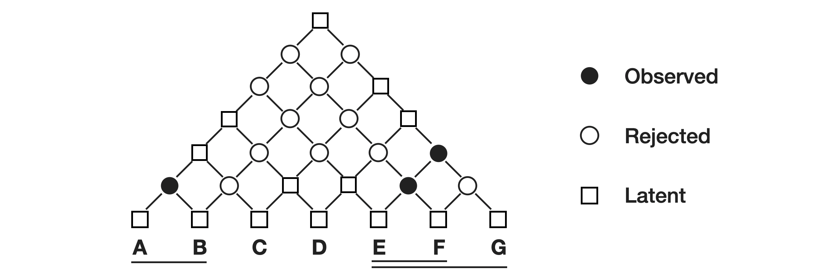

Yao Fu, Chuanqi Tan, Mosha Chen, Songfang Huang and Fei Huang. _Nested Named Entity Recognition with Partially Observed TreeCRFs_. AAAI 2021


Train:
```bash
python train.py --output_dir {OUTPUT_DIR} --model_type bert --config_name {BERT_CONFIG} --model_name_or_path {BERT_DIR} --train_file {TRAIN_FILE} --predict_file {DEV_FILE} --test_file {TEST_FILE} --max_seq_length 64 --per_gpu_train_batch_size 48 --per_gpu_eval_batch_size 48 --do_train --do_predict --learning_rate 3e-5 --num_train_epochs 100 --overwrite_output_dir --save_steps 1000 --dataset {DATASET_NAME}} --potential_normalization True --structure_smoothing_p 0.98 --parser_type deepbiaffine --latent_size 1 --seed 12345
```

Test:
```bash
python train.py --output_dir {CHECKPOINT_DIR} --model_type bert --config_name {BERT_CONFIG} --model_name_or_path {BERT_DIR} --train_file {TRAIN_FILE} --predict_file {DEV_FILE} --test_file {TEST_FILE} --max_seq_length 128 --per_gpu_train_batch_size 24 --per_gpu_eval_batch_size 24 --do_predict --learning_rate 3e-5 --num_train_epochs 100 --overwrite_output_dir --save_steps 1000 --dataset {DATASET_NAME}} --potential_normalization True --structure_smoothing_p 0.98 --parser_type deepbiaffine --latent_size 1 --seed 12345
```

Only for test:
```bash
ACE04
python train.py --output_dir /home/chuanqi.tcq/partial-pcfg/result/ACE04/test_release --model_type bert --config_name ~/bert/bert-large-cased/bert_config.json --model_name_or_path ~/bert/bert-large-cased --train_file /home/chuanqi.tcq/partial-pcfg/partial-pcfg/data/ACE2004/train.data --predict_file /home/chuanqi.tcq/partial-pcfg/partial-pcfg/data/ACE2004/dev.data --test_file /home/chuanqi.tcq/partial-pcfg/partial-pcfg/data/ACE2004/test.data --max_seq_length 64 --per_gpu_train_batch_size 48 --per_gpu_eval_batch_size 48 --do_train --do_predict --learning_rate 2e-5 --num_train_epochs 100 --overwrite_output_dir --save_steps 1000 --dataset ACE04 --potential_normalization True --structure_smoothing_p 0.99 --parser_type deepbiaffine --latent_size 1 --seed 12345
```

```bash
ACE05
python train.py --output_dir /home/chuanqi.tcq/partial-pcfg/result/ACE05/test_release --model_type bert --config_name ~/bert/bert-large-cased/bert_config.json --model_name_or_path ~/bert/bert-large-cased --train_file /home/chuanqi.tcq/partial-pcfg/partial-pcfg/data/ACE2005/train.data --predict_file /home/chuanqi.tcq/partial-pcfg/partial-pcfg/data/ACE2005/dev.data --test_file /home/chuanqi.tcq/partial-pcfg/partial-pcfg/data/ACE2005/test.data --max_seq_length 64 --per_gpu_train_batch_size 48 --per_gpu_eval_batch_size 48 --do_train --do_predict --learning_rate 3e-5 --num_train_epochs 100 --overwrite_output_dir --save_steps 1000 --dataset ACE05 --potential_normalization True --structure_smoothing_p 0.98 --parser_type deepbiaffine --latent_size 1 --seed 12345
```

```bash
GENIA
python train.py --output_dir /home/chuanqi.tcq/partial-pcfg/result/GENIA/test_release --model_type bert --config_name ~/bert/biobert_v1.1_pubmed/bert_config.json --model_name_or_path ~/bert/biobert_v1.1_pubmed --train_file /home/chuanqi.tcq/partial-pcfg/partial-pcfg/data/GENIA/train.data --predict_file /home/chuanqi.tcq/partial-pcfg/partial-pcfg/data/GENIA/dev.data --test_file /home/chuanqi.tcq/partial-pcfg/partial-pcfg/data/GENIA/test.data --max_seq_length 96 --per_gpu_train_batch_size 96 --per_gpu_eval_batch_size 96 --do_train --do_predict --learning_rate 3e-5 --num_train_epochs 100 --overwrite_output_dir --save_steps 1000 --dataset GENIA --potential_normalization True --structure_smoothing_p 0.98  --latent_size 2 --parser_type deepbiaffine --seed 1234
```
